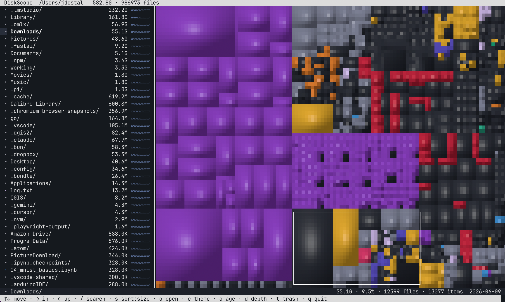

# DiskScope

**A native macOS WinDirStat — with Everything-style instant search built in.** Hit scan,
and seconds later see exactly what's eating your disk as a fast, live, cushioned
**treemap** next to a dense, sortable directory tree. Scan once, and DiskScope stays
warm forever: the index persists, replays the filesystem journal on launch, and answers
any filename search in milliseconds — from the app, the terminal, or a global-hotkey
panel that works everywhere.


DiskScope renders disk usage as a *squarified treemap*: every file becomes a rectangle sized
by the bytes it eats, packed to stay near-square and readable, and each rectangle is drawn as
a 3D "cushion" with per-pixel Phong lighting written straight into a raw RGBA bitmap (no
system 2D-drawing APIs), then tinted by file type through a perceptually-uniform **OKLCH**
color palette. The scan itself is a parallel `getattrlistbulk(2)` walk, so a whole disk
indexes in seconds — and only ever has to do it once.

## Features

- **Instant search** — every filename in an in-memory blob swept at memory bandwidth:
  single-digit milliseconds per keystroke over a million files, ranked prefix > word-start >
  substring, biggest first. `⌘F` in the app, `/` in the TUI, both live as you type.
- **Query filters** — `ext:swift` · `size:>1.5gb` · `size:<10mb` · `kind:file|folder` ·
  `path:working`; bare words AND together.
- **Search everywhere** — closing the window leaves a menu-bar agent running: a global
  hotkey (configurable; Spotlight-style floating panel) searches every local volume as one
  namespace. Volumes index on mount, drop on eject; optional launch-at-login.
- **Warm start** — the index persists and relaunch replays only the FSEvents journal since
  you quit: a 1M-file disk reopens in well under a second, offline changes included.
- **Live updates** — the treemap, tree, and legend track filesystem changes in real time
  (incremental reconciles, not rescans).
- **Cushioned treemap** — squarified, area-proportional, van Wijk cushion shading with a
  specular glint, Retina-resolution, colored by file category in OKLCH. Double-click to
  drill into a folder; hover to inspect; Space for Quick Look.
- **Dense directory tree** — name, %-bar, file count, size, and last-modified columns;
  selection syncs with the treemap both ways.
- **File-type legend** — per-extension breakdown; click a type to isolate its tiles on the map.
- **Reclaim pane** — "where did my disk go": scanned files vs volume used, the Time Machine
  snapshot + purgeable gap explained (one-click thin), and known space hogs found in your
  scan — DerivedData, caches, iOS backups, Docker images, topmost `node_modules`.
- **Themes** — a big library of curated OKLCH palettes plus a **Custom** theme with live
  sliders, shared by the app and the TUI; optional age-fade and depth-fade layers.
- **Real file actions** — Reveal in Finder, Open, Quick Look, Move to Trash (the index
  updates in place).
- **Full Disk Access** onboarding so protected folders get counted.
- **A full terminal UI** — the same engine, same instant search, same themes, rendered as a
  navigable cushioned treemap right in your terminal (plus SVG/PNG and benchmark CLI modes).

## Install

**Homebrew (recommended):**

```sh
brew install --cask jasondostal/tap/diskscope
xattr -dr com.apple.quarantine /Applications/DiskScope.app
```

DiskScope is independently distributed — ad-hoc signed, not notarized (open source pet
projects don't pay Apple $99/yr), so macOS blocks the first launch until you clear the
quarantine flag (the `xattr` line above) or use **Open Anyway** in System Settings →
Privacy & Security. (Older Homebrew had `--no-quarantine`; Homebrew 5 removed it.)

**Terminal UI only (no Gatekeeper involved at all):**

```sh
brew install jasondostal/tap/diskscope-cli
```

The standalone `diskscope` binary is the full interactive treemap + instant search in your
terminal. Formula installs never get the quarantine attribute — this is the friction-free
path, and one of the reasons the TUI exists.

**Or grab the DMG / CLI tarball** from the [latest release](https://github.com/jasondostal/diskscope/releases/latest)
— the quarantine note applies to direct downloads.

Requires **macOS 14+**. It is intentionally not sandboxed — a whole-disk indexer needs to read
the whole disk.

## Terminal UI

Just run `diskscope` — with no arguments it opens a fully interactive treemap of the current
directory right in your terminal — same scan, same cushions, warm-started from the shared
index when one exists. Pass a path to scope it there. Needs a **truecolor** terminal
(iTerm2, Ghostty, kitty, WezTerm).

Drive it with the keyboard or the mouse: arrows/`hjkl` move, `→` drills in, `/` searches
live (same filters as the app), `s` cycles sort, `c` picks a theme, `a`/`d` toggle age and
depth shading, `t` trashes, and clicking list rows or treemap tiles selects them directly.



```sh
diskscope                  # interactive terminal UI of the current directory
diskscope <path>           # …of <path> instead
diskscope --treemap <path> # render a treemap SVG
diskscope --term <path>    # static cushioned treemap, printed once
diskscope --bench <path>   # one-shot scan summary (counts, size, wall-clock)
```

Piped or redirected (a non-interactive stdout), bare `diskscope` prints the `--bench` summary
instead of the TUI, so it stays scriptable.

(Installed via Homebrew the CLI is on your PATH as `diskscope`; from source the product is
`diskscope-scan`.)

## Build from source

Requires the Swift toolchain (full Xcode for the GUI; Command Line Tools is enough for the CLI).

```sh
swift build --product DiskScopeApp && .build/debug/DiskScopeApp   # or: make run
make app        # build dist/DiskScope.app
make dmg        # + a distributable DMG
swift test
```

## License

[MIT](LICENSE) © Jason Dostal
