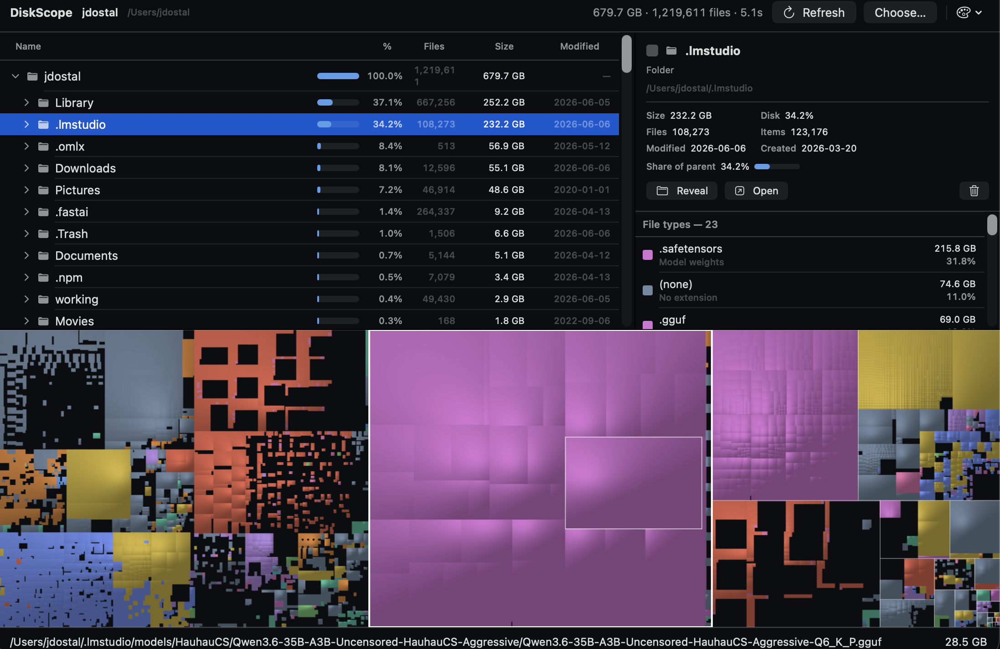

# DiskScope

**A native macOS WinDirStat** — hit scan, and seconds later see exactly what's eating your
disk as a fast, live, cushioned **treemap** next to a dense, sortable directory tree.



DiskScope renders disk usage as a *squarified treemap*: every file becomes a rectangle sized
by the bytes it eats, packed to stay near-square and readable, and each rectangle is drawn as
a 3D "cushion" with per-pixel Phong lighting written straight into a raw RGBA bitmap (no
system 2D-drawing APIs), then tinted by file type through a perceptually-uniform **OKLCH**
color palette.

## Why

DaisyDisk and GrandPerspective exist, but nothing on the Mac combines **native SwiftUI**,
**WinDirStat-style information density** (tree + columns + legend + a treemap), and a
**scary-fast whole-drive scan**. The Windows tools (WizTree/Everything) are fast because they
read the NTFS Master File Table directly — and macOS/APFS has no MFT. So the fast scan *is*
the engineering: DiskScope builds it with `getattrlistbulk(2)` and a parallel directory walk.

## Features

- **Cushioned treemap** — squarified, area-proportional, van Wijk cushion shading, colored by
  file category in OKLCH.
- **Dense directory tree** — name, %-of-parent bar, file count, size, and last-modified
  columns; click-to-reveal in the treemap and back.
- **File-type legend** — per-extension breakdown; click a type to isolate its tiles on the map.
- **Selection inspector** — size, share of disk/parent, file & item counts, modified/created.
- **Themes** — multiple curated OKLCH palettes (Spectrum, Dracula, Catppuccin, Nord,
  Solarized, Synthwave, Gruvbox, Cairn) plus a **Custom** theme with live sliders.
- **Real file actions** — Reveal in Finder, Open, Move to Trash (the index updates in place).
- **Full Disk Access** onboarding so protected folders get counted.
- **Other front-ends on the same engine** — an interactive **TUI** (`--tui`), plus SVG/PNG and
  truecolor-terminal treemap renderers, and a benchmarking CLI.

## The scan

Measured on an M5 Pro (Apple Silicon), Data volume, ~1.71M entries, warm cache:

| Scanner | Time | Rate |
|---|--:|--:|
| serial | 20.9s | 82k/s |
| parallel ×8 | **4.2s** | **410k/s** |

A full *sized* index of a whole disk lands in well under ten seconds. Key findings (details in
[`docs/research/`](docs/research/)):

- The scan is **kernel/syscall-bound**, not language-bound — stripping ~1.5M `String`
  allocations moved the time ~2%, so a C/Rust/Go rewrite would buy nothing per-core; parallelism
  is the lever.
- APFS metadata reads **scale across cores**; workers are capped at the performance-core count
  (over-subscribing past the P-cores drags the whole parallel section down on Apple Silicon).
- APFS **firmlinks** expose the same directory under two paths (`/Users` *and*
  `/System/Volumes/Data/Users`); directories are de-duplicated by `(device, inode)`.
- Reading raw APFS metadata off the block device (the WizTree trick) was evaluated and
  **rejected** for a consumer app — see [`docs/research/raw-apfs-parsing.md`](docs/research/raw-apfs-parsing.md).

## Build & run

Requires the Swift toolchain (full Xcode for the GUI; Command Line Tools is enough for the CLI).

```sh
# GUI app
swift build --product DiskScopeApp && .build/debug/DiskScopeApp   # or: make run

# package a real .app / DMG (see Packaging/README.md)
make app        # dist/DiskScope.app
make dmg        # + a distributable DMG

# tests
swift test
```

### CLI / TUI

```sh
swift build -c release --product diskscope-scan
.build/release/diskscope-scan --tui <path>        # interactive terminal UI (truecolor)
.build/release/diskscope-scan --treemap <path>    # render a treemap SVG
.build/release/diskscope-scan --term <path>       # static cushioned treemap in the terminal
.build/release/diskscope-scan <path> [workers]    # scan benchmark
```

## Architecture

- **`Sources/DiskScopeCore/`** — the engine (no UI, fully tested): the `getattrlistbulk`
  scanner, a flat-arena file index with live FSEvents reconcile, the squarified treemap layout
  + cushion renderer, and the OKLCH `FilePalette`. Everything else is a client of this.
- **`Sources/DiskScopeApp/`** — the SwiftUI app.
- **`Sources/diskscope-scan/`** — the CLI + TUI.
- **`Tests/DiskScopeCoreTests/`** — the engine suite.

## Requirements

macOS 14+. Distributed as a Developer ID–signed, notarized `.app` (not sandboxed — a
whole-disk indexer needs to read the whole disk).

## License

[MIT](LICENSE) © Jason Dostal
